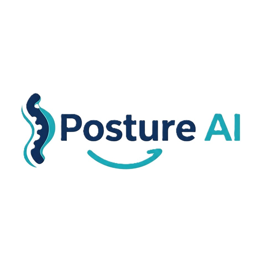

# PostureAI

<p align="center">
  
</p>

**Sit better. Work smarter.**

**PostureAI** is a macOS app that corrects your posture, prevents neck pain, and builds healthier habits — without breaking your focus. It uses the motion sensors in your AirPods (or your Mac's camera) to track your head tilt locally on your Mac. When slouching is detected, it applies a gentle progressive screen blur that clears instantly the moment you sit up straight.

[](https://www.apple.com/macos/)
[](https://www.swift.org)
[](LICENSE)

---

## The Problem

Professionals spend excessive hours at computers, leading to forward-head "turtle neck" posture and severe neck pain.

- **1.71 billion** people worldwide are affected by musculoskeletal disorders (WHO, 2022) — neck pain alone affects **222 million** people.
- Your head weighs about **10–12 lb** upright — but tilt it just 15° and the load on your cervical spine jumps to **27 lb**. At 60° it reaches **60 lb**, roughly the weight of a 7-year-old child hanging from your neck.
- Average daily screen time keeps climbing, and posture-related pain keeps rising with it.

Traditional posture correction requires expensive secondary hardware or intrusive camera setups that raise significant privacy concerns. Private physiotherapy can cost **HK$8,000–25,000+** per course of treatment.

## Our Solution

A single, lightweight app that prevents — rather than merely treats — the problem, and helps you build a healthier habit without changing how you work.

<p align="center">
  AirPods motion sensors track your posture → AI detects slouching → a gentle blur reminds you to sit up straight
</p>

## Features

- **AirPods motion tracking** — Uses the pitch angle of your head, tracked by compatible AirPods (Pro, Max, or 3rd generation+), with no camera access required
- **Camera tracking** — Apple Vision framework body-pose analysis for a fully camera-based alternative
- **Automatic source switching** — Intelligently switches between camera and AirPods based on device availability
- **Progressive screen blur** — A visual reminder that intensifies as posture worsens and clears instantly when you sit up straight
- **Customizable reminder styles** — Progressive blur, subtle screen-edge glow, colored borders, or solid overlays
- **Deep analytics dashboard** — Daily posture scores and improvement trends tracked over weeks and months
- **Smart, personalizable calibration** — Dynamic calibration and five sensitivity levels tuned to your own sitting habits
- **Local AI processing** — All motion and image data is processed entirely on your Mac; nothing is ever uploaded
- **Zero cloud infrastructure** — No servers, no accounts, no subscription overhead
- **Menu bar controls** — Quick access to status, settings, calibration, and quit
- **Multi-display support** — Works across all connected monitors
- **Lightweight background app** — Minimal resource usage; never interrupts your flow
- **6 languages** — English, Spanish, French, German, Japanese, and Simplified Chinese

## How It Works

### AirPods Mode

Uses the motion sensors in compatible AirPods (Pro, Max, 3rd generation+, macOS 14+):

- **Head-tilt detection** — Tracks the pitch angle of your head continuously
- **No camera required** — Your posture is measured privately, using only motion data
- **Automatic pause** — Tracking pauses when your AirPods are removed

### Camera Mode

Uses Apple's Vision framework to detect body-pose landmarks:

- **Body-pose detection** — Tracks nose and head position
- **Face-detection fallback** — Falls back to face tracking when your full body isn't visible
- **Posture analysis** — Measures vertical head position against your calibrated baseline

In both modes, when slouching is detected the app applies a progressive screen blur; the blur clears the moment you sit up straight.

## Validation

In a study with 30 students:

- **82%** of participants corrected their posture within **5 seconds** of an AirPods reminder
- Groups using micro-reminders reported **35% less fatigue** after 0.5–1 hour of continuous work compared to the no-reminder group

## Building from Source

PostureAI is written in Swift and builds with Swift Package Manager. A normal user can build and run the app in a few minutes.

### Requirements

- **macOS 13.0 (Ventura) or later**
- **Xcode Command Line Tools** — install with `xcode-select --install`
- Internet access (first build downloads dependencies)

### Build Steps

```bash
# 1. Get the source code
git clone https://github.com/jeffrey1024hk-stack/HKICT.git
cd HKICT

# 2. Resolve dependencies (Swift Composable Architecture + Sparkle)
swift package resolve

# 3. Build the app
./build.sh
```

The finished app will be at `build/PostureAI.app`.

### Run It

```bash
# Launch the app
open build/PostureAI.app

# Or install it into your Applications folder
cp -r build/PostureAI.app /Applications/
```

### Build Options

```bash
./build.sh              # Standard release build (universal, arm64 + x86_64)
./build.sh --dev        # Fast debug build (host architecture only) — great for testing changes
./build.sh --release    # Standard build + create a distributable .zip archive
./build.sh --appstore   # App Store build (no private APIs)
```

### Troubleshooting

- **`swift package resolve` failed** — Make sure you're connected to the internet and have a recent Xcode Command Line Tools version installed (`xcode-select --install`).
- **`Sparkle.framework not found`** — Run `swift package resolve` first; this fetches the embedded auto-update framework.
- **First launch asks for permissions** — Grant Camera (camera mode) or Motion & Fitness Activity (AirPods mode) access in **System Settings** → **Privacy & Security**. All processing stays on-device.

## Usage

Once launched, PostureAI lives in your menu bar. Click the icon to:

- See your current status (Monitoring, Slouching, Good Posture)
- Toggle posture monitoring on/off
- **Recalibrate** — sit up straight, then click to reset your baseline
- Open **Settings** to configure sensitivity, dead zone, reminder style, and more
- Quit the app

### Tips for Best Results

- Position your camera at eye level with adequate lighting (camera mode)
- Sit at a consistent distance from your screen
- Keep your shoulders visible in frame (camera mode)
- Recalibrate whenever your sitting position or setup changes

## Privacy

PostureAI processes everything locally on your Mac. No images, motion data, or usage statistics are ever sent to external servers, stored, or transmitted. The camera feed is used solely for posture detection and is never recorded. There is no account, no cloud, and no tracking — just your posture, your data, on your device.

## Roadmap

- **Broader integration** — Expand compatibility to other spatial-audio and motion-enabled headphones
- **Smarter insights** — Correlate posture trends with specific daily routines and desktop apps
- **Platform expansion** — Evaluate iOS and iPadOS versions for mobile professionals
- **AI posture coach** — Personalized, machine-learning suggestions (e.g., "You tend to slouch after 3 PM — try a scapular retraction exercise")

## Project Structure

```
├── Sources/
│   ├── App/                      # Executable entry point (PostureAIMain.swift)
│   ├── Core/                     # Pure logic (tracking state, posture engine, analytics)
│   ├── AppDelegate/              # App coordinator, effects, and app intents
│   ├── Detectors/                # Camera & AirPods posture detectors
│   ├── System/                   # OS observers and global hotkey
│   ├── Settings/                 # Settings keys, migrations, profiles
│   ├── UI/                       # Menu bar, overlays, windows (Settings, Calibration, Onboarding, Analytics)
│   ├── Resources/                # Localizations (6 languages)
│   └── Localization.swift        # Localization helpers
├── Tests/                        # Headless unit tests
├── build.sh                      # Build script
├── release.sh                    # Release automation
└── Package.swift                 # Swift Package Manager manifest
```

## Contributing

Contributions are welcome! Feel free to open issues and pull requests.

## License

MIT License — see [LICENSE](LICENSE) for details.

---

<p align="center">
  <strong>PostureAI</strong> · Sit better. Work smarter.
</p>